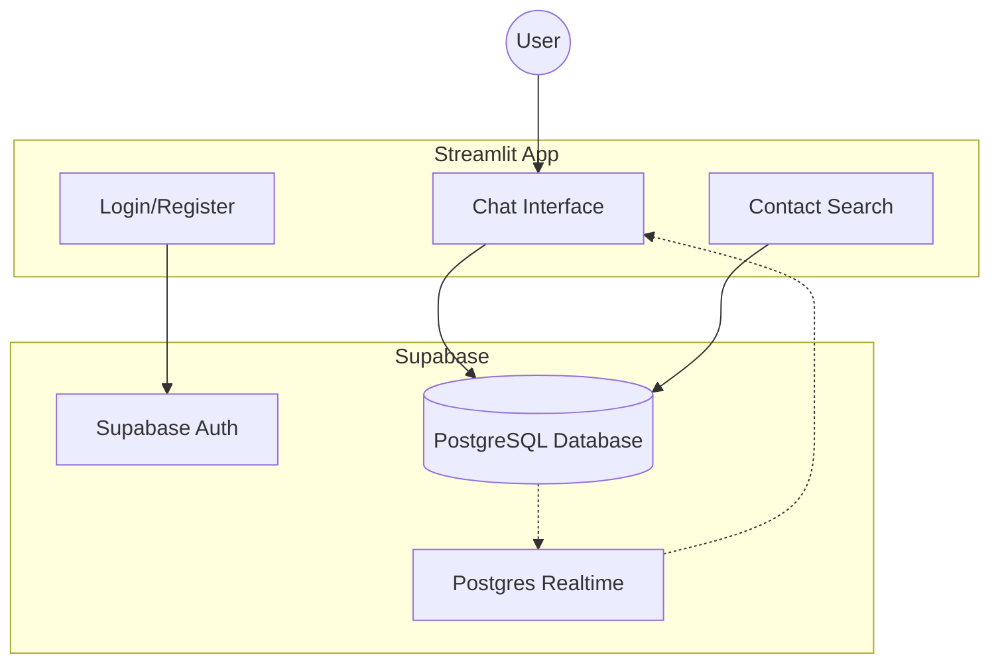

# PerzChat 💬

PerzChat is a real-time, personal messaging application built with Streamlit and powered by Supabase. It offers a sleek interface for private conversations, contact management, and real-time notifications.

## 🚀 Features

- **Real-time Messaging**: Experience instant message delivery and read receipts (✓✓).
- **Secure Authentication**: Robust login, registration, and password reset via Supabase Auth.
- **Contact Management**: Search for users by username or email and add them to your private contact list.
- **Dynamic UI**: A modern, bottom-up chat interface with automatic scrolling and mobile-friendly design.
- **Account Privacy**: Secure account deletion that wipes all personal data, contacts, and messages.

## 🏗️ Architecture



## 🛠️ Prerequisites

- Python 3.8+
- [Supabase Account](https://supabase.com/)

## ⚙️ Setup Instructions

### 1. Clone the Repository
```bash
git clone <repository-url>
cd PerzChat
```

### 2. Set Up Virtual Environment
```bash
python -m venv venv
source venv/bin/activate  # On Windows: venv\Scripts\activate
```

### 3. Install Dependencies
```bash
pip install -r requirements.txt
```

### 4. Configuration
Create a `.streamlit/secrets.toml` file in the project root with your Supabase credentials:

```toml
SUPABASE_URL_STREAMCHAT = "your-supabase-url"
SUPABASE_KEY_STREAMCHAT = "your-supabase-service-role-key"
```

## 📖 Usage Examples

### Starting the App
Run the following command in your terminal:
```bash
streamlit run streamlit_app.py
```

### Common Flows
1. **Register/Login**: Start by creating an account or logging in with your username.
2. **Add Contacts**: Use the sidebar search to find friends by their username or email.
3. **Chat**: Select a contact from your list to start a real-time conversation.
4. **Refreshing**: Use the "Refresh" button in the chat header to sync messages if needed.

## 📄 License
This project is licensed under the MIT License - see the [LICENSE](LICENSE) file for details.
